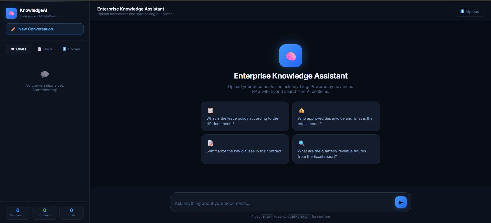

# 🧠 Enterprise AI Knowledge Assistant

```

```

> **Talk to your company documents using AI** — Upload PDFs, Word files, Excel sheets, and images. Ask anything in plain English and get accurate answers with source citations, powered by a fully local AI stack.

<div align="center">


</div>

---

## 📸 What It Looks Like

```
┌─────────────────────────────────────────────────────────┐
│  🧠 KnowledgeAI  │ 💬 Chats │ 📄 Docs │ ⬆️ Upload      │
├──────────────────┼──────────────────────────────────────┤
│                  │                                      │
│  📋 HR Policy    │  You: What is the leave policy?      │
│  📊 Q3 Report    │                                      │
│  📝 Contract     │  🧠 AI: According to the HR Policy   │
│                  │  document (Page 4), employees are    │
│  🔍 Filter chat  │  entitled to 21 days of paid leave   │
│  to this doc     │  annually...                         │
│                  │                                      │
│  ─────────────── │  📎 Sources                          │
│  Docs: 3         │  [1] HR_Policy.pdf — p.4             │
│  Chunks: 847     │  [2] Employee_Handbook.pdf — p.12    │
│  Chats: 5        │                                      │
└──────────────────┴──────────────────────────────────────┘
```

---

## ✨ Features

### 🔍 Advanced Retrieval (What Makes It Enterprise-Grade)

| Feature | Description |
|---------|-------------|
| **Hybrid Search** | Combines dense vector search (ChromaDB) + sparse BM25 keyword search, fused with Reciprocal Rank Fusion |
| **Parent-Child Chunking** | Small 256-token child chunks are indexed; 1024-token parent chunks are returned for richer context |
| **Multi-Query Expansion** | LLM generates 3 alternative phrasings of your question → more recall |
| **Cross-Encoder Reranking** | FlashRank re-scores all retrieved chunks → picks the most relevant 5 |
| **Metadata Filtering** | Filter chat responses to only search within specific documents |
| **Conversation Memory** | Last 5 turns of conversation injected into the prompt automatically |
| **Citations** | Every answer shows source filename, page number, and chunk preview |

### 📄 Document Support

| Format | Parser Used | Notes |
|--------|-------------|-------|
| **PDF** | PyMuPDF | Text + tables, page-aware |
| **DOCX** | python-docx | Full Word document support |
| **XLSX** | openpyxl | Sheet data as structured text |
| **Images** | EasyOCR | JPG, PNG, GIF, BMP, TIFF, WEBP |

### ⚡ Streaming & Real-Time

- **LangGraph pipeline** manages the state machine: Retrieve → Expand → Rerank → Generate
- **Server-Sent Events (SSE)** streams tokens word-by-word to the browser
- **Persistent sessions** saved in `sessions/*.json` — your chat survives browser refresh
- **Background ingestion** — files are uploaded instantly and processed asynchronously

---

## 🏗️ Architecture

```
┌────────────────────────────────────────────────────────────────┐
│                        UPLOAD FLOW                             │
│                                                                │
│  File Upload → Document Processor → Parent-Child Chunker       │
│                     ↓                        ↓                 │
│              Text Extraction          256-token children        │
│              (PDF/DOCX/XLSX/OCR)      1024-token parents       │
│                                              ↓                 │
│                                    nomic-embed-text             │
│                                    (Ollama embeddings)         │
│                                              ↓                 │
│                              ┌───────────────┴──────────────┐  │
│                              │ ChromaDB (child vectors)     │  │
│                              │ ChromaDB (parent texts)      │  │
│                              │ BM25 Index (keyword search)  │  │
│                              └──────────────────────────────┘  │
└────────────────────────────────────────────────────────────────┘

┌────────────────────────────────────────────────────────────────┐
│                         QUERY FLOW                             │
│                                                                │
│  User Query                                                    │
│      ↓                                                         │
│  ┌─────────────────── LangGraph Pipeline ──────────────────┐  │
│  │                                                          │  │
│  │  [1] RETRIEVE                                            │  │
│  │       Multi-Query Expansion (3 variants via LLM)         │  │
│  │       Dense Search  (ChromaDB vector similarity)         │  │
│  │       Sparse Search (BM25 keyword matching)              │  │
│  │       RRF Fusion    (combine & deduplicate)              │  │
│  │            ↓                                             │  │
│  │  [2] EXPAND PARENTS                                      │  │
│  │       Child chunks → look up parent context              │  │
│  │            ↓                                             │  │
│  │  [3] RERANK                                              │  │
│  │       FlashRank cross-encoder → top 5                    │  │
│  │            ↓                                             │  │
│  │  [4] BUILD PROMPT                                        │  │
│  │       Inject: context + citations + memory               │  │
│  │                                                          │  │
│  └──────────────────────────────────────────────────────────┘  │
│       ↓                                                        │
│  Ollama (qwen2.5:7b) → Streaming tokens via SSE                │
│       ↓                                                        │
│  Browser renders answer + citation cards in real-time          │
└────────────────────────────────────────────────────────────────┘
```
##  System works end-to-end:
```
UPLOAD FLOW
═══════════
File → Document Processor → Parent-Child Chunker → Embedder → ChromaDB + BM25

QUERY FLOW  
══════════
Your Question
     ↓
[LangGraph Node 1] RETRIEVE
   → Multi-Query: LLM makes 3 variations of your question
   → Dense Search: ChromaDB finds semantically similar chunks
   → Sparse Search: BM25 finds keyword-matching chunks
   → RRF Fusion: merges and deduplicates both result lists
     ↓
[LangGraph Node 2] EXPAND PARENTS
   → Small child chunks → look up their bigger parent for more context
     ↓
[LangGraph Node 3] RERANK
   → FlashRank scores all 20 results → keeps top 5
     ↓
[LangGraph Node 4] BUILD PROMPT
   → Injects: context + citations + last 5 conversation turns
     ↓
Ollama qwen2.5:7b → Streams tokens via SSE → Browser renders live
```

---

## 📁 Project Structure

```
enterprise-rag/
│
├── 🖥️  backend/                    Python FastAPI backend
│   ├── main.py                    Entry point — FastAPI app + lifecycle
│   ├── config.py                  All settings (models, paths, RAG params)
│   ├── requirements.txt           Python dependencies
│   │
│   ├── api/
│   │   ├── chat.py                Chat API: SSE streaming + sessions + conversations
│   │   └── documents.py           Document API: upload, list, delete, stats
│   │
│   ├── database/
│   │   └── db.py                  SQLite models: Documents, Conversations, Messages
│   │
│   ├── models/
│   │   └── schemas.py             Pydantic request/response schemas
│   │
│   └── services/
│       ├── rag_chain.py           ⭐ LangGraph state machine (full pipeline)
│       ├── hybrid_search.py       Dense + Sparse → RRF fusion
│       ├── multi_query.py         LLM query expansion (3 variants)
│       ├── reranker.py            FlashRank cross-encoder reranking
│       ├── vector_store.py        ChromaDB operations (child + parent collections)
│       ├── bm25_store.py          BM25 sparse keyword index (rank-bm25)
│       ├── chunker.py             Parent-child chunking (1024/256 tokens)
│       ├── embedder.py            nomic-embed-text via Ollama API
│       ├── document_processor.py  PDF/DOCX/XLSX/Image parsing
│       └── conversation.py        Session persistence (JSON files)
│
├── 🌐  frontend/                   Pure HTML/CSS/JS frontend
│   ├── index.html                 App shell with sidebar + chat + upload
│   ├── css/styles.css             Dark glassmorphism design system
│   └── js/
│       ├── app.js                 Bootstrap, session restore, health check
│       ├── chat.js                Streaming chat, markdown render, citations
│       ├── documents.js           Doc list, doc filter chips
│       ├── upload.js              Drag & drop, upload progress, status polling
│       └── api.js                 Centralized API client (SSE streaming)
│
├── 📦  venv/                       Python virtual environment (Python 3.12)
├── 💾  chroma_db/                  ChromaDB vector store (auto-created)
├── 📁  uploads/                    Uploaded document files (auto-created)
├── 📝  sessions/                   Session JSON files (auto-created)
├── 🗄️  rag.db                      SQLite database (auto-created)
│
├── 🚀  start.bat                   One-click startup script
├── 📦  install.bat                 Install dependencies into venv
├── 🙈  .gitignore                  Excludes venv, DB, uploads from git
└── 📖  README.md                   This file
```

---

## 🚀 Quick Start

### Prerequisites

| Tool | Version | Download |
|------|---------|---------|
| **Python** | 3.12 (required — NOT 3.13/3.14) | [python.org](https://python.org/downloads/release/python-31210/) |
| **Ollama** | Latest | [ollama.com](https://ollama.com) |
| **Git** | Any | [git-scm.com](https://git-scm.com) |

---

### Step 1 — Clone the Repository

```bash
git clone https://github.com/yourusername/enterprise-rag.git
cd enterprise-rag
```

---

### Step 2 — Install Dependencies (into venv)

**Option A — Double-click `install.bat`**

**Option B — Manual:**
```bat
REM Create virtual environment with Python 3.12
py -3.12 -m venv venv

REM Activate it
venv\Scripts\activate

REM Install all packages
pip install -r backend\requirements.txt
```

---

### Step 3 — Download AI Models via Ollama

```bash
# Start Ollama (if not already running)
ollama serve

# Download the LLM (4.7 GB — one-time download)
ollama pull qwen2.5:7b

# Download the embedding model (274 MB)
ollama pull nomic-embed-text
```

---

### Step 4 — Run the App

**Option A — Double-click `start.bat`** ← Easiest, does everything automatically

**Option B — Manual:**
```bat
REM Activate venv
venv\Scripts\activate

REM Start the backend
cd backend
python main.py
```

Then open **http://localhost:8000** in your browser. ✅

---

### Step 5 — Use It!

1. **Click "⬆️ Upload"** in the sidebar
2. **Drag & drop** any PDF, Word, Excel, or image file
3. **Wait** for the ✓ Ready status (takes 5–60 seconds depending on file size)
4. **Click "💬 New Conversation"**
5. **Type your question** and press Enter
6. Watch the AI answer stream in real-time with citations! 🎉

---

## ⚙️ Configuration

Edit [`backend/config.py`](backend/config.py) to customize:

```python
# AI Models
LLM_MODEL    = "qwen2.5:7b"        # Change to qwen2.5:14b for better quality (needs 8GB+ VRAM)
EMBED_MODEL  = "nomic-embed-text"  # High quality 768-dim embeddings

# RAG Parameters
RETRIEVAL_K      = 20   # How many chunks to initially retrieve
RERANK_TOP_K     = 5    # How many chunks after reranking (sent to LLM)
MULTI_QUERY_COUNT = 3   # Number of query variants to generate
MEMORY_WINDOW    = 5    # How many conversation turns to remember
PARENT_CHUNK_SIZE = 1024  # Parent chunk token size
CHILD_CHUNK_SIZE  = 256   # Child chunk token size (indexed)

# Limits
MAX_FILE_SIZE_MB = 50   # Max upload size
```

---

## 🔌 API Reference

### Documents

| Method | Endpoint | Description |
|--------|----------|-------------|
| `POST` | `/api/documents/upload` | Upload a document (multipart/form-data) |
| `GET` | `/api/documents` | List all documents with status |
| `DELETE` | `/api/documents/{id}` | Delete document + all its vectors |
| `GET` | `/api/documents/stats` | Collection statistics |

### Chat

| Method | Endpoint | Description |
|--------|----------|-------------|
| `POST` | `/api/chat/stream` | **Streaming SSE chat** (main endpoint) |
| `GET` | `/api/conversations` | List all conversations |
| `POST` | `/api/conversations` | Create a new conversation |
| `GET` | `/api/conversations/{id}/messages` | Get full message history |
| `DELETE` | `/api/conversations/{id}` | Delete conversation |

### Sessions

| Method | Endpoint | Description |
|--------|----------|-------------|
| `GET` | `/api/sessions/{id}` | Get session state (active conv, filters) |
| `PUT` | `/api/sessions/{id}` | Save session state |

### Streaming Chat Request Body

```json
{
  "conversation_id": "uuid-string",
  "message": "What is the leave policy?",
  "document_filter": ["doc-id-1", "doc-id-2"]
}
```

### SSE Event Types

```
data: {"type": "status",   "message": "🔍 Searching documents..."}
data: {"type": "citation", "data": [{filename, page, chunk_text, score}]}
data: {"type": "token",    "content": "According"}
data: {"type": "token",    "content": " to"}
data: {"type": "done",     "answer": "...", "citations": [...]}
data: {"type": "error",    "message": "..."}
data: [DONE]
```

Also see the auto-generated Swagger docs at: **http://localhost:8000/docs**

---

## 🖥️ Hardware Requirements

| Component | Minimum | Recommended |
|-----------|---------|-------------|
| **RAM** | 8 GB | 16 GB |
| **VRAM** | 4 GB | 8 GB |
| **Storage** | 10 GB free | 20 GB |
| **CPU** | 4 cores | 8 cores |
| **OS** | Windows 10+ / Linux / Mac | Windows 11 |

> **This project was built and tested on:** Intel i5-10300H, 16 GB RAM, GTX 1650 (4 GB VRAM)

### Model Selection Guide

| Model | VRAM | Quality | Speed |
|-------|------|---------|-------|
| `qwen2.5:7b` (default) | 4–5 GB | ⭐⭐⭐⭐ | ⚡⚡⚡ |
| `qwen2.5:14b` | 8–9 GB | ⭐⭐⭐⭐⭐ | ⚡⚡ |
| `llama3.2:3b` | 2–3 GB | ⭐⭐⭐ | ⚡⚡⚡⚡ |

---

## 🛠️ Tech Stack

| Layer | Technology | Purpose |
|-------|-----------|---------|
| **Frontend** | HTML5 + CSS3 + Vanilla JS | UI — no framework needed |
| **Backend** | Python 3.12 + FastAPI | REST API + SSE streaming |
| **AI Orchestration** | LangChain 0.3 + LangGraph 0.2 | Pipeline state machine |
| **LLM** | Ollama (qwen2.5:7b) | Local inference — no API costs |
| **Embeddings** | nomic-embed-text (via Ollama) | 768-dim dense vectors |
| **Vector Store** | ChromaDB 0.5 | Dense semantic search |
| **Keyword Search** | rank-bm25 | Sparse BM25 retrieval |
| **Reranking** | FlashRank | CPU-based cross-encoder |
| **Database** | SQLite + SQLAlchemy (async) | Documents + conversations |
| **Document Parsing** | PyMuPDF + python-docx + openpyxl + EasyOCR | Multi-format support |

---

## 📝 Resume Description

> **Enterprise RAG Platform** — Built a full-stack document intelligence system using Python FastAPI + LangGraph. Implemented advanced retrieval with Hybrid Search (ChromaDB dense vectors + BM25 sparse, fused via Reciprocal Rank Fusion), Parent-Child Chunking, Multi-Query Expansion, and Cross-Encoder Reranking (FlashRank). Features real-time token streaming via Server-Sent Events, persistent conversation memory, and source citation generation. Runs entirely locally using Ollama (qwen2.5:7b LLM + nomic-embed-text embeddings) with zero API costs.

---

## 🐛 Troubleshooting

### Backend won't start
```bash
# Make sure you're using Python 3.12, NOT 3.13 or 3.14
venv\Scripts\python.exe --version   # Should say Python 3.12.x

# Re-install if needed
venv\Scripts\pip.exe install -r backend\requirements.txt
```

### Ollama not found
```bash
# Check PATH or restart terminal after installing
ollama --version

# If not found, add to PATH or use full path:
# C:\Users\<username>\AppData\Local\Programs\Ollama\ollama.exe
```

### Model not downloaded yet
```bash
ollama list   # See what models are available
ollama pull qwen2.5:7b         # ~4.7 GB
ollama pull nomic-embed-text   # ~274 MB
```

### ChromaDB telemetry error (harmless)
The error `capture() takes 1 positional argument but 3 were given` is a ChromaDB telemetry bug — it doesn't affect functionality. Ignore it.

### Upload stuck at "Processing"
- Check backend terminal for errors
- EasyOCR downloads models on first use (~1.5 GB) — wait for it to complete
- Make sure Ollama is running for embeddings

---

## 📄 License

MIT License — free to use, modify, and distribute.

---

<div align="center">
  Built with ❤️ using Python, FastAPI, LangGraph, and Ollama
</div>
